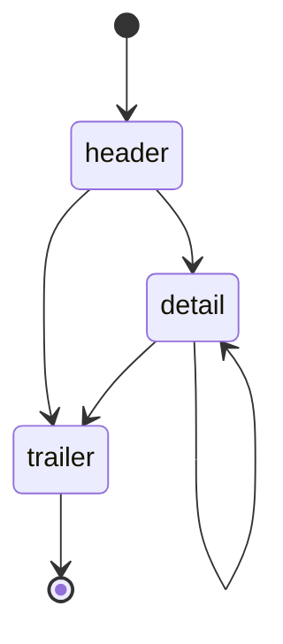

# Batch Eligibility Request File

Versions 5.0 through 19.1 are currently supported. Most of these are autogenerated and thus missing from the repository.

## Layout

The file consists of a mandatory header, zero or more detail records, and a mandatory trailer.

